  

  

  
  
  

---

### 💻 Terminal Snapshot

  

---

### 🧐 About Me

I am an undergraduate student at **Zhejiang University**, majoring in **Computer Science** and minoring in **ACEE**.  
I keep my coursework, CTF learning, lab reports, and research notes in public repositories so they stay structured, searchable, and reusable.

My current interests mainly lie in:

- **Cybersecurity:** hands-on labs, system security, network security, and practical offensive/defensive learning.
- **CTF & Applied Cryptography:** solving challenges, writing notes, and building stronger fundamentals through practice.
- **Systems & Networking:** Linux, architecture, protocol-level understanding, and reproducible experiments.
- **Knowledge Infrastructure:** turning scattered learning materials into long-lived notebooks and reference repositories.

---

### 🛠️ Tech Stack

  

  
  
  
  
  

---

### 🚀 Featured Repositories

| Repository | Direction | Description |
| --- | --- | --- |
| [MyNotebook](https://github.com/BruceJqs/MyNotebook) | Personal knowledge base | A long-term notebook for courses, CTF writeups, technical references, and research reading notes |
| [ZJU-Courses](https://github.com/BruceJqs/ZJU-Courses) | Academic archive | Notes and homework collected during study at Zhejiang University |
| [seed-emulator](https://github.com/BruceJqs/seed-emulator) | Security / networking | Internet emulation and lab-oriented experimentation for cybersecurity education |
| [seed-labs](https://github.com/BruceJqs/seed-labs) | Security labs | Practical materials across crypto, software, network, web, and hardware security |

---

### 📊 GitHub Analytics

  
  

---

### 📈 Contribution Graph

  

---

### 📫 Contact

- GitHub: [@BruceJqs](https://github.com/BruceJqs)
- Email: [brucejin1005@gmail.com](mailto:brucejin1005@gmail.com)
- Notebook: [BruceJin's Notebook](https://note.eternity1005.top/)
